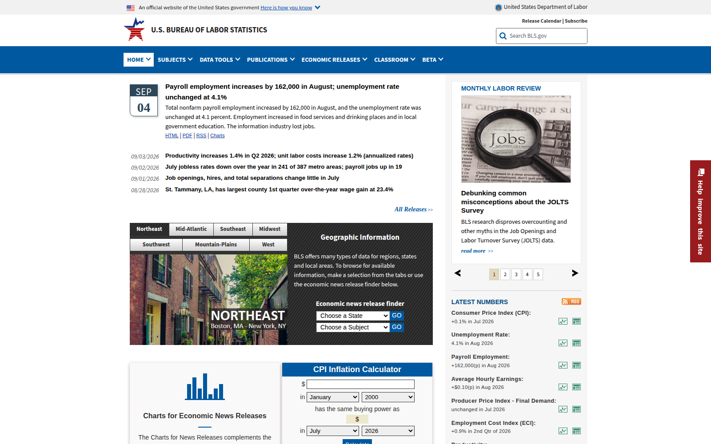
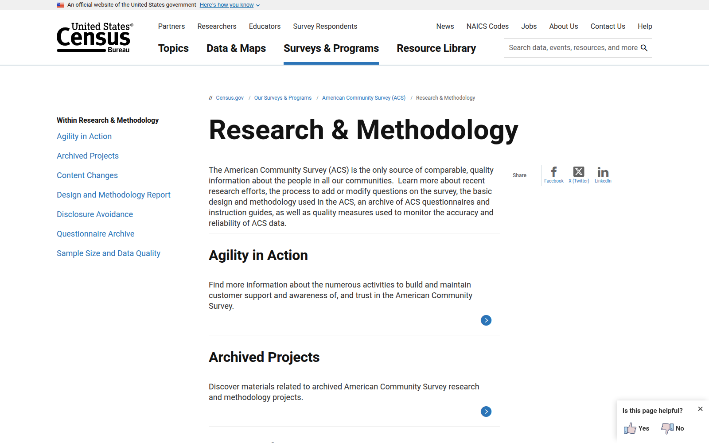
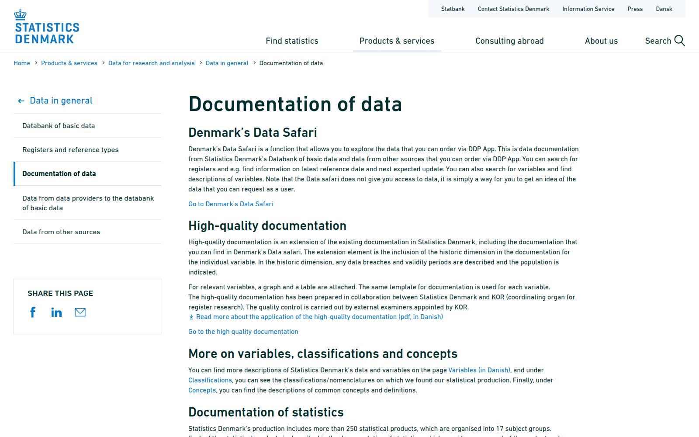
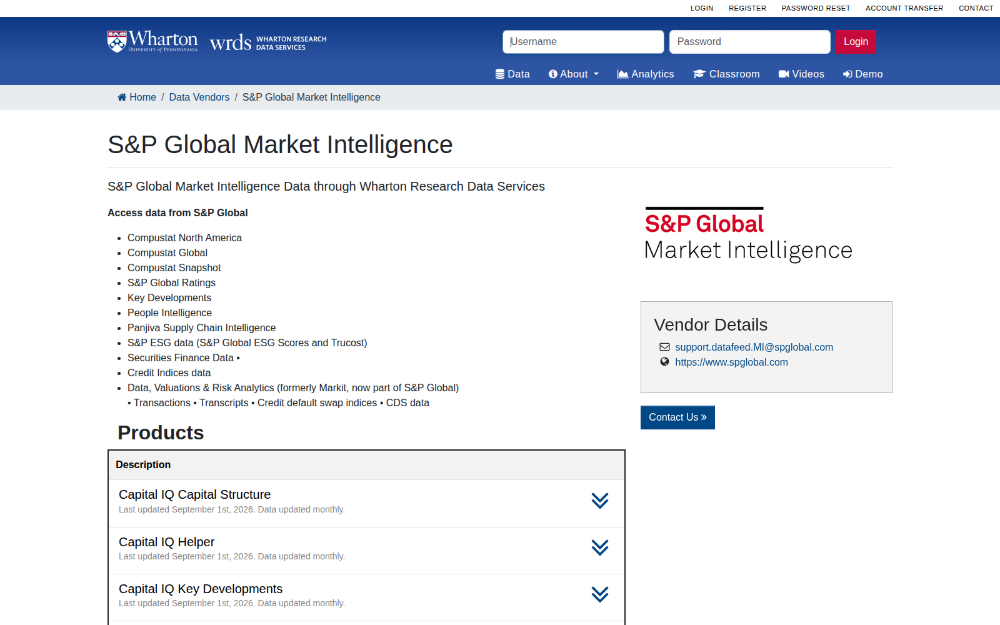

# Pillar A: Data Quality

## Data quality

## What counts as "quality" data? {.smaller}

## What counts as "quality" data? {.smaller}

::::{.columns}
:::{.column width="50%"}

- Official Statistics

:::
:::{.column width="50%"}

:::
::::

## What counts as "quality" data? {.smaller}

::::{.columns}
:::{.column width="50%"}

- Official Statistics
- High-quality survey data
  - traditionally well documented (methods reports)

:::
:::{.column width="50%"}

:::
::::

## What counts as "quality" data? {.smaller}

::::{.columns}
:::{.column width="50%"}

- Official Statistics
- High-quality survey data
- Administrative data: 
  - "fit for purpose"? Depends on usage, coverage — ultimately an expert assessment
  - Often thinner, but longer

:::
:::{.column width="50%"}

:::
::::

## What counts as "quality" data? {.smaller}

::::{.columns}
:::{.column width="50%"}

- Official Statistics
- High-quality survey data
- Administrative data: 
- Business data: 
  - fine detail, but possibly non-representative
  - designed for a different purpose
  - often proprietary

:::
:::{.column width="50%"}

:::
::::
