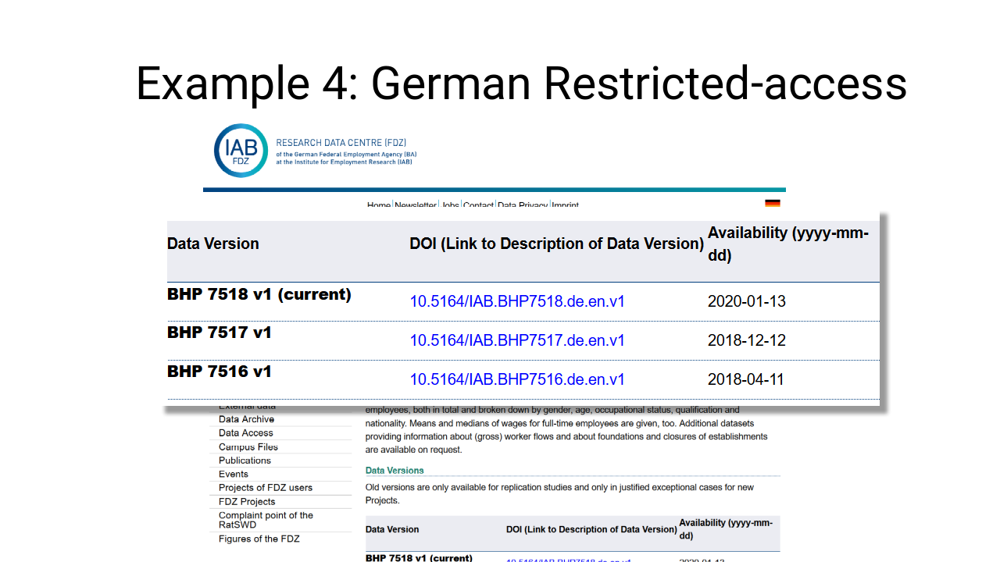
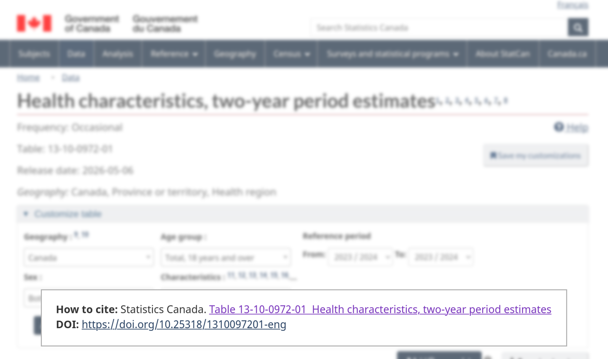

# Pillar B: Data Provenance

## Data provenance

## Part of data quality is provenance

## Gold standard

- Statistical agency surveys
- Big research institutions

## Gold standard: curation

- DOI assignment, curation

## Examples

## Examples

