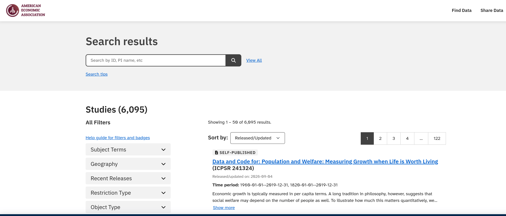
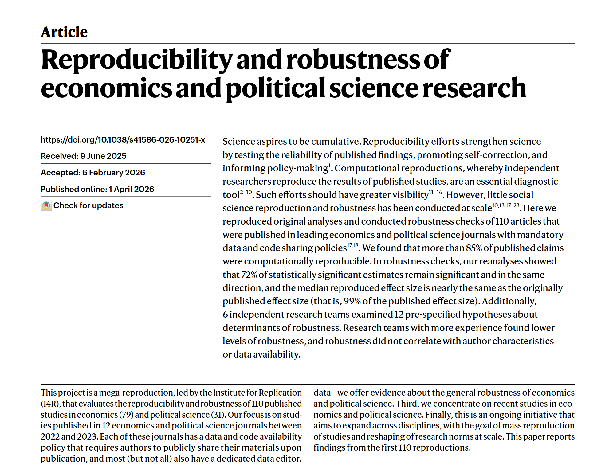
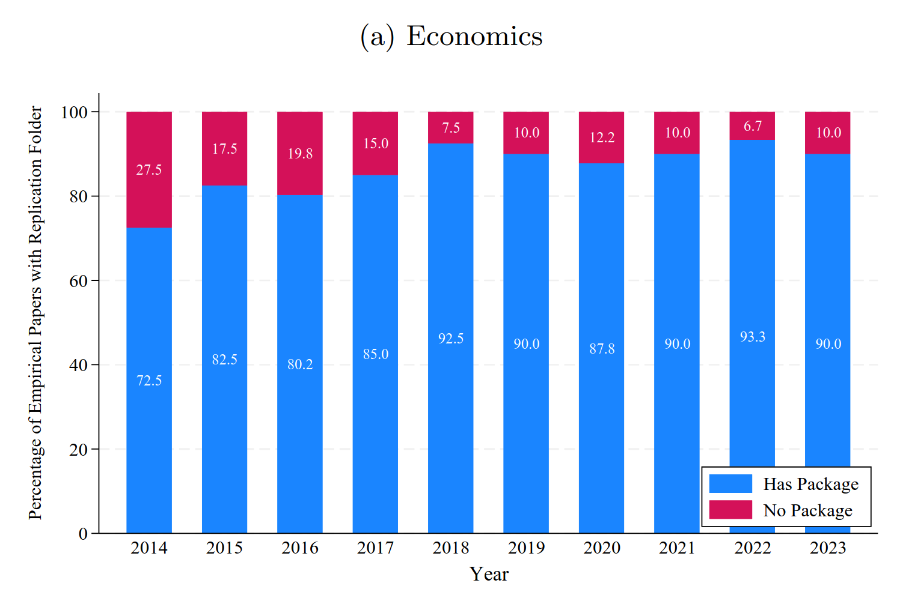

# Pillar C: Code

## Code

## Availability of code

::::{.columns}
::: {.column width="50%"}

- Data and **Code** availability policies at journals
- Data Editors that monitor compliance

:::

::: {.column width="50%"}

:::

::::

## Data Editor of the AEA

::::{.columns}
::: {.column width="50%"}

- ~3000 Manuscripts and 4500 Reports, approx. 4800 authors reached.

:::
::: {.column width="50%"}

:::
::::

## Repositories

As of Dec 2025:[^report2026]

| Repository | Published | Downloads | Files | Size (GB) |
|:-----------|----------:|----------:|------:|----------:|
| ICPSR      | 5,748 | 662,209 | 44,850 | 922.88 |
| Zenodo     |    29 | 285,508 |  6,427 | 813.07 |

[^report2026]: Vilhuber. "Report of the AEA Data Editor", AEA Papers and Proceedings 2026, 116: 890–904
https://doi.org/10.1257/pandp.116.890

## Repositories

::::{.columns}
::: {.column width="30%"}

- 6,095 as of today, earliest 1999

:::
::: {.column width="70%"}

:::
::::

## {background-image="images/socsci-webpage.png" background-size="contain"}

## Data Editors {.smaller}

::::{.columns}

:::{.column width="50%"}

- [American Economic Association](https://www.aeaweb.org/journals/) (8)
- [Econometric Society](https://www.econometricsociety.org/) (3)
- [Canadian Journal of Economics](https://www.economics.ca/cje-home) (1)
- [Royal Economic Society](https://res.org.uk/journals/) (2)
- [Western Economic Association International](https://weai.org/view/EI-Journal-Policies) (1)
- [European Economic Association](http://www.eeassoc.org/journal) (1)
- [Review of Economic Studies](https://www.restud.com/) (1)
- [**Journal of the European Economic Association**](https://academic.oup.com/jeea) (1)
- [**Journal of Political Economy**](https://www.journals.uchicago.edu/journals/jpe/about) (3)

:::

:::{.column width="50%"}

:::

::::

## Assessment by the discipline

::::{.columns}

:::{.column width="50%"}

:::

:::{.column width="50%"}

Brodeur, Abel, Derek Mikola, Nikolai Cook, et al. 2026. “Reproducibility and Robustness of Economics and Political Science Research.” Nature 652 (April): 151–56. https://doi.org/10.1038/s41586-026-10251-x.

:::

::::

## Replication package availability

::::{.columns}

:::{.column width="50%"}

:::

:::{.column width="50%"}

> ... from **72%** to **near 90%** (not all journals have data editors!)

:::

::::

## Computational reproducibility (conditional on data)

::::{.columns}

:::{.column width="50%"}

:::

:::{.column width="50%"}

> ... **computational reproducibility rate of 85%**... 15% ... only partial availability of code or data ... code did not run...

:::

::::

