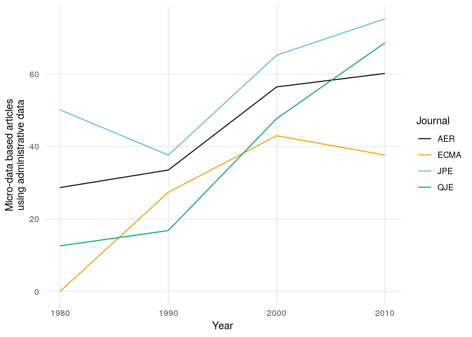
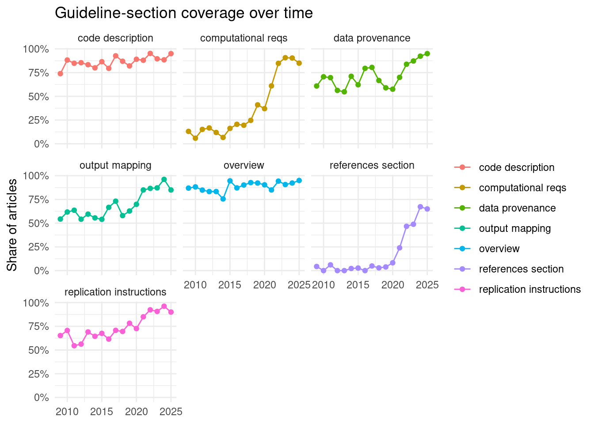
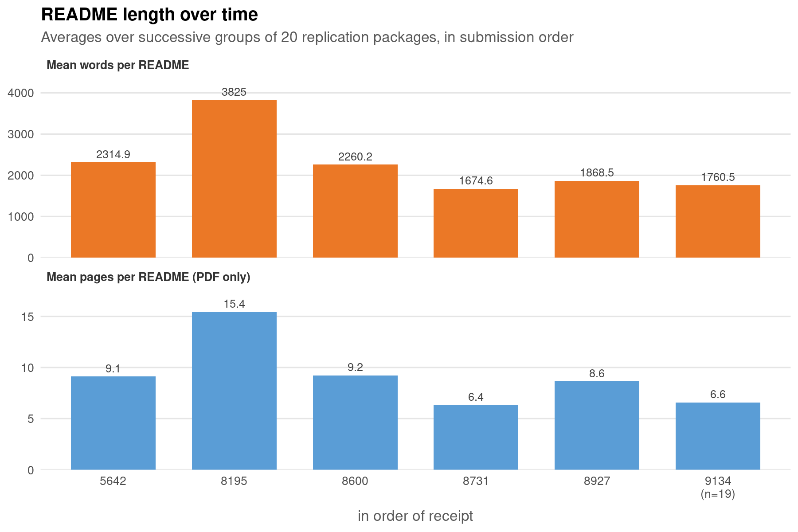

# Pillar D: Documentation


## Old data point


::::{.columns}

:::{.column width="50%"}

Chetty et al (2012)

> Micro-data based articles using administrative data: increasing strongly


:::

:::{.column width="50%"}



:::

::::


## New data point


::::{.columns}

:::{.column width="50%"}

Schmidt... Vilhuber (2026) [^schmidt-vilhuber-2026]

[^schmidt-vilhuber-2026]: Schmidt, Klaus M., Levent Neyse, Marianne Saam, Doreen Siegfried, Lars Vilhuber, and Joachim Winter. 2026. “Open Science in Den {W}irtschaftswissenschaften: {T}ransparenz, {R}eproduzierbarkeit Und {Z}ugang.” Perspektiven Der Wirtschaftspolitik, ahead of print, June 27. https://doi.org/10.1515/pwp-2026-0019.


> Articles in AER with any access restrictions: **40%**.


:::

:::{.column width="50%"}


:::

::::

## Improvement over time of READMEs?


::::{.columns}

:::{.column width="50%"}

ChatGPT analysis of several thousand econ packages ([Find Economic Articles with Data](https://ejd.econ.mathematik.uni-ulm.de/), analysis shared with me by Sebastian Kranz, University of Ulm)


:::

:::{.column width="50%"}



:::

::::

## Effect of one data editor


```{r, echo=FALSE, message=FALSE, warning=FALSE}
source("length-of-readmes.R")
```

::::{.columns}

:::{.column width="50%"}

Random set of `r nrow(readmes)` AER replication packages that happened to be on my computer (improvement coming)

:::

:::{.column width="50%"}



:::

::::


## Anectodotal evidence: assessing accessibility

- in preparing the code quality paper (see later), 
- RAs reported **difficulty** understanding the READMEs in the AER
- then attempted READMEs from an (unnamed) journal without a data editor and declared it **impossible**...