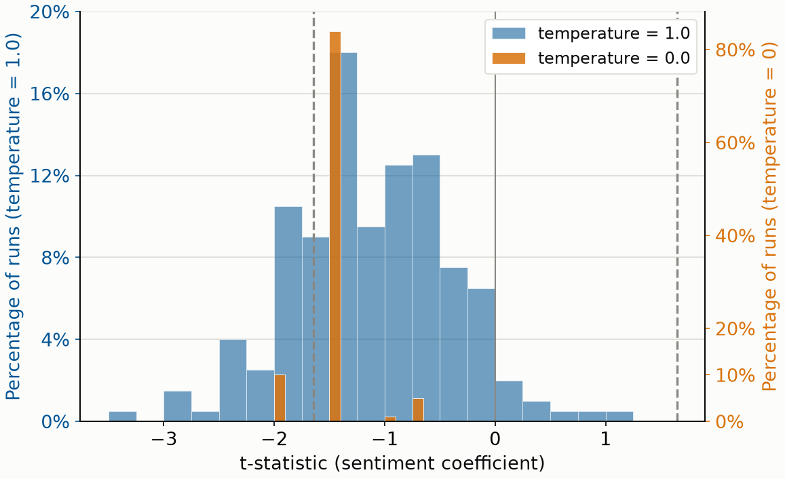
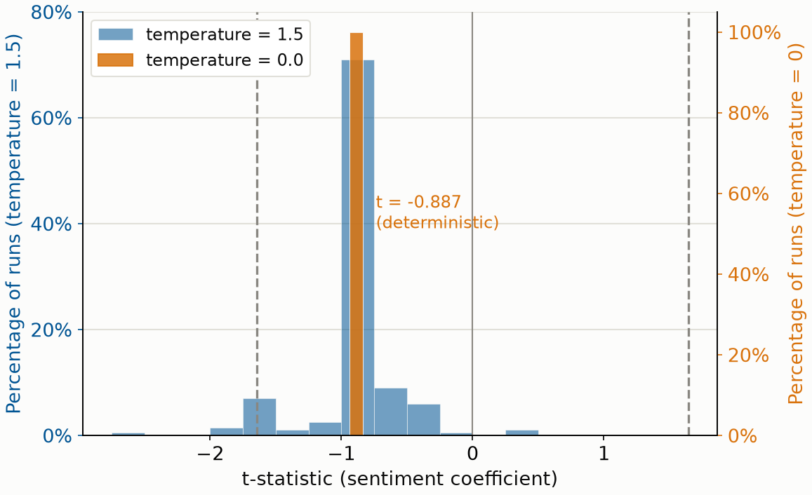

# Pillar A: Risks to Data Quality


## Traditional concerns 

Argentinian inflation data[^caballo]


[^caballo]: Cavallo, Alberto. 2013. “Online and Official Price Indexes: Measuring Argentina’s Inflation.” Journal of Monetary Economics 60 (2): 152–65. https://doi.org/10.1016/j.jmoneco.2012.10.002.

## Data manipulation


::::{.columns}

:::{.column width="50%"}

- Data manipulation post-publication
- Changes to data collection protocols (subtle or not)


:::

:::{.column width="50%"}

[](https://www.datarescueproject.org/)

:::

::::


## New concerns: LLM-generated data

## Inherent variability

- LLMs are **probabilistic** by design, so some variability is expected
- "Temperature" is meant to control this, but imperfect

> Is your result robust?


## Coqueret, Llull, Oswald, Pérignon, Scheuch, Vilhuber (2026) {.smaller background-color="#4d4d4d"}

**Randomness in Large Language Models: What Researchers Need to Know (and Report)**[^coqueret2026]

[^coqueret2026]: Coqueret, Guillaume, Joan Llull, Florian Oswald, Christophe Pérignon, Christoph Scheuch, and Lars Vilhuber. 2026. “Randomness in Large Language Models: What Researchers Need to Know (and Report).” arXiv:2607.24372. Preprint, arXiv, July 27. https://doi.org/10.48550/arXiv.2607.24372.


- "Temperature = 0" does **not** make a commercial API deterministic
  - silent model updates behind unchanged model names
  - floating-point rounding that depends on server load, batching, hardware
  - expert routing (mixture-of-experts) depends on *other users'* requests
- Seeds only help if prompt, model, decoding, sampling implementation **and serving environment** are all fixed
- Several frontier "reasoning" models have **removed** user-settable temperature altogether
- A researcher who queries the model **once** has drawn a single realization from that distribution


## Coqueret et al (2026): Illustration {.smaller background-color="#4d4d4d"}

- Distribution of downstream regression test statistics is wide enough that a non-trivial share of runs cross conventional significance thresholds — and others do not

::: {#fig-deepseek layout-ncol=2}
{#fig-deepseek-sub}

{#fig-gemma-sub}

Distribution of $t$ statistics over 200 runs. Blue is $T>0$, orange is $T=0$.
:::

## Experimental design {background-color="#4d4d4d"}

A classic sentiment regression, in the spirit of Tetlock et al.
(2008)[^tetlock2008] and Loughran and McDonald (2011).[^loughran2011]

$$ r_{i,t} = \alpha + \beta \, s_{i,t} + e_{i,t} $$

We are interested in the  $t$ statistic.


[^tetlock2008]: Tetlock, Paul C., Maytal Saar-Tsechansky, and Sofus Macskassy. 2008. “More Than Words: Quantifying Language to Measure Firms’ Fundamentals.” Journal of Finance 63 (3): 1437–67. https://doi.org/10.1111/j.1540-6261.2008.01362.x.

[^loughran2011]: Loughran, Tim, and Bill McDonald. 2011. “When Is a Liability Not a Liability? Textual Analysis, Dictionaries, and 10-Ks.” Journal of Finance 66 (1): 35–65. https://doi.org/10.1111/j.1540-6261.2010.01625.x.

## Experimental design {background-color="#4d4d4d"}

:::: {.columns}
::: {.column width="52%"}
**Data and task**

- Excerpts from Item 1 and Item 1A of 2025 annual filings
- S&P 500 firms, the 100 shortest excerpts
- The model returns exactly one word
- Positive, neutral or negative, coded $1$, $0$, $-1$
:::
::: {.column width="46%"}
**Protocol**

- The identical prompt is repeated 200 times
- Three models, run on 20 July 2026
- Temperature is tunable for two of them only

:::
::::

## The task, concretely {.smaller background-color="#4d4d4d"}

:::: {.columns}
::: {.column width="56%"}
**Input: Item 1 + Item 1A excerpt** (Amgen, 10-K)

> ```
> Item 1. Business
> Amgen Inc. discovers, develops, manufactures and delivers
> innovative medicines to fight some of the world's toughest
> diseases. We focus on areas of high unmet medical need and
> leverage our expertise to strive for solutions that
> dramatically improve people's lives [...]
> ```

6,780 words total, truncated here for space — the model reads all of it.
:::
::: {.column width="40%"}
**Instruction, appended verbatim**

*"Classify the overall tone of this passage from a company's 10-K filing
as positive, negative, or neutral for the company. Answer with exactly
one word: positive, negative, or neutral."*
:::
::::

. . .

**Model output, this firm, 200 repeated runs (DeepSeek)**

- $T=0$: `neutral` — 200/200 runs
- $T=1$: `neutral` (193), `positive` (6), `negative` (1)

Same filing, same question — the sign itself flips on 7 of 200 runs.

## The three models {.smaller background-color="#4d4d4d"}

| Model | Access | Temperature |
|:------|:-------|:------------|
| GPT 5.6 Luna | API, closed weights | not available, reasoning set to none |
| DeepSeek V4 Pro | API, open weights | tunable, we use $0$ and $1$ |
| Gemma 4 26B | local, 24 GB of RAM | tunable, we use $0$ and $1.5$ |

: The three models used in the experiment, and what each one lets the user set.[^compute-clopsv] {#tbl-models}

[^compute-clopsv]: Cost, for the record: 
GPT 5.6: about \$49 and under 100 minutes, for 274.2M input tokens.
DeepSeek: about \$3.7 for 535.5M input tokens. Output is one word per
call. Both use prompt caching.


## Result 2: temperature zero, on the API and locally {background-color="#4d4d4d"}

::: {#fig-deepseek layout-ncol=2}
{#fig-deepseek-sub}

{#fig-gemma-sub}

Distribution of $t$ statistics over 200 runs. Blue is $T>0$, orange is $T=0$.
:::

## Reading the second result {.smaller background-color="#4d4d4d"}

:::: {.columns}
::: {.column width="48%"}
**DeepSeek, served by API**

At $T=1$ the spread resembles the closed model: 69 firms out of 100 are
classified differently in at least one of the 200 runs. At $T=0$ the
distribution tightens sharply, yet does not collapse. Estimates take
four distinct values. Two firms out of 100 are classified differently
across runs.
:::
::: {.column width="48%"}
**Gemma 4, run locally**

At $T=1.5$, 27 firms out of 100 are classified differently in at least
one of the 200 runs. At $T=0$ the whole mass sits on a single value.
Residual variability disappears entirely: no firm is ever classified
differently. Output is deterministic under the conditions of this
experiment.
:::
::::

## For more information {background-color="#4d4d4d"}

<https://floswald.github.io/pdf/llm-randomness-slides.pdf>

> Coqueret, Guillaume, Joan Llull, Florian Oswald, Christophe Pérignon, Christoph Scheuch, and Lars Vilhuber. 2026. “Randomness in Large Language Models: What Researchers Need to Know (and Report).” arXiv:2607.24372. Preprint, arXiv, July 27. <https://doi.org/10.48550/arXiv.2607.24372>


## New concerns