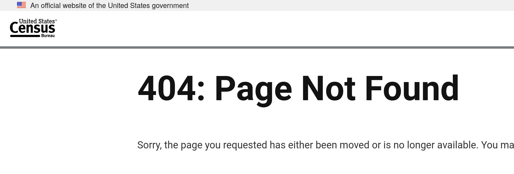
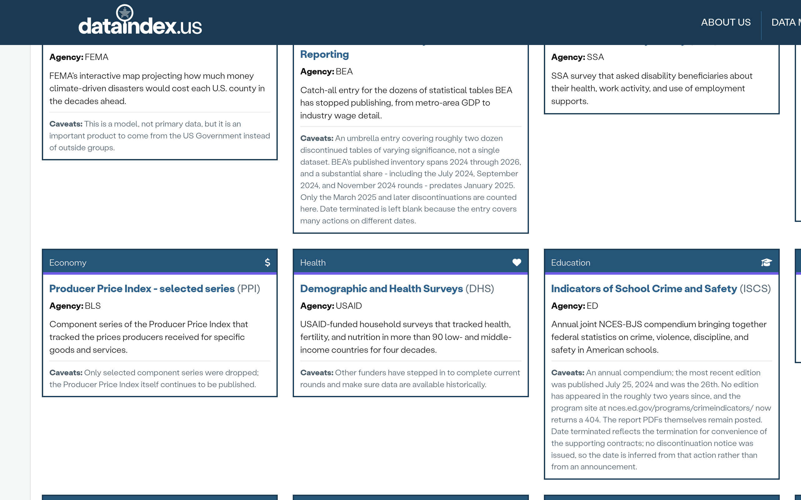
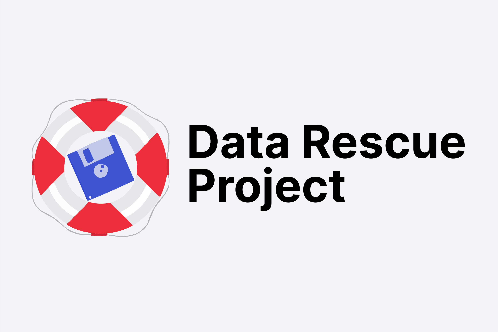
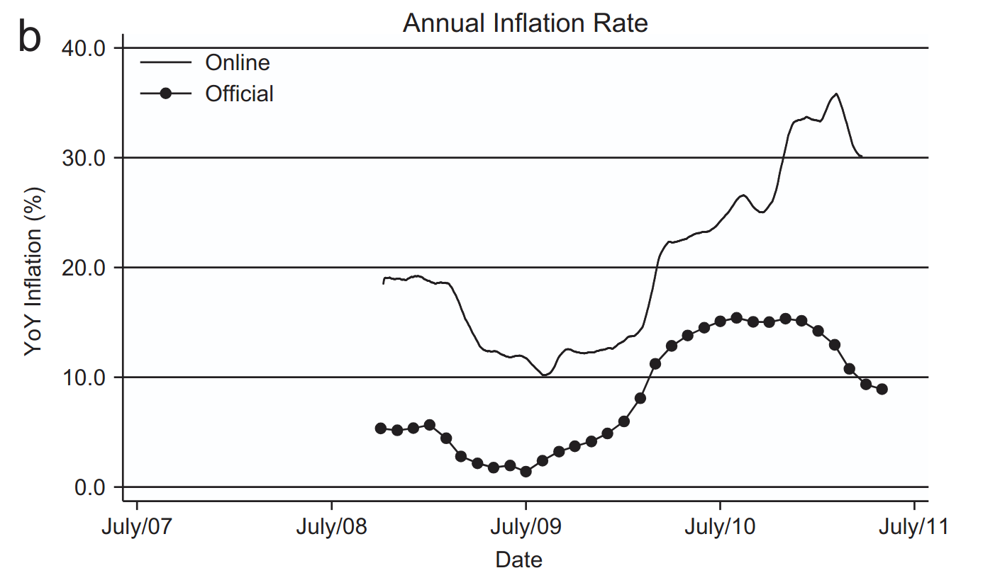
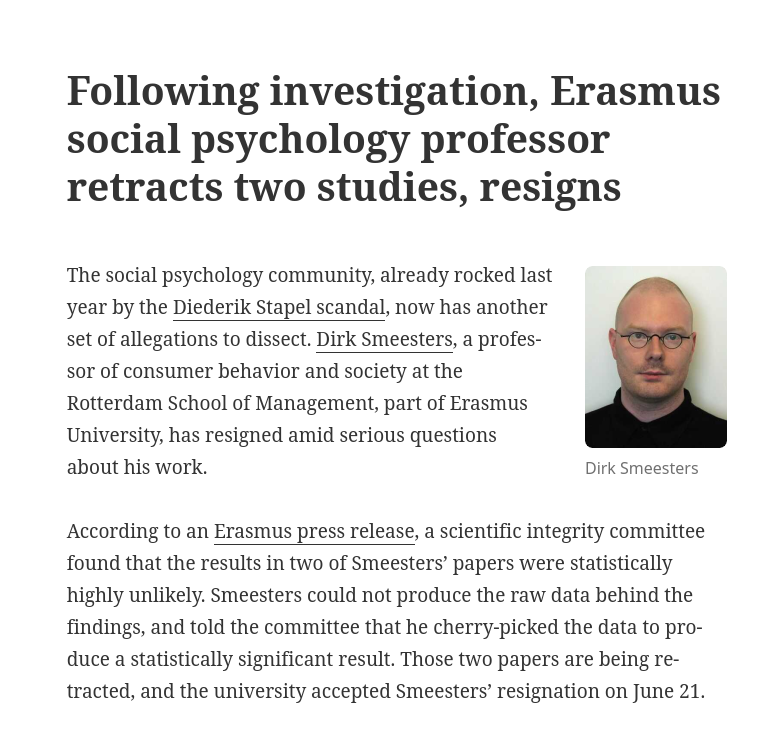

# Pillar B: Data Provenance

## Data provenance

## Part of data quality is provenance

## Gold standard

- Statistical agency surveys
- Big research institutions

## Gold standard: curation

- DOI assignment, curation

## Examples

## Examples

## DOI: Mostly absent at statistical agencies

## Curation: Mostly absent at statistical agencies

## Curation: Mostly absent at statistical agencies

## Worse: concerns 

Argentinian inflation data[^caballo]

[^caballo]: Cavallo, Alberto. 2013. “Online and Official Price Indexes: Measuring Argentina’s Inflation.” Journal of Monetary Economics 60 (2): 152–65. https://doi.org/10.1016/j.jmoneco.2012.10.002.

## Surveys and such  {.smaller}

## Who is this person?

## Dirk Smeesters

## Retraction {.smaller}

::::{.columns}  

::: {.column width="10%"}
:::
::: {.column width="80%"}
"a scientific integrity committee found that the results in two of Smeesters’ papers were **statistically highly unlikely**. Smeesters *could not produce the raw data* behind the findings, and told the committee that he **cherry-picked** the data to produce a statistically significant result. Those two papers are being retracted, and the university accepted Smeesters’ *resignation* on June 21."

:::
::: {.column width="10%"}
:::
::::

## Who is this person? (2)

## The case of Gino

- Francesca Gino was a *tenured* professor at Harvard Business School, writing on **honesty** (!)

## The case of Gino

- Several articles were investigated by third parties (*Data Colada*, in particular [^colada1]), and found to be **problematic**

::::{.columns}  

::: {.column width="10%"}
:::

::: {.column width="80%"}

:::
::: {.column width="10%"}
:::
::::

[^colada1]: <https://datacolada.org/109>, <https://datacolada.org/110>, <https://datacolada.org/111>, <https://datacolada.org/112>, <https://datacolada.org/114>, <https://datacolada.org/118>

## The case of Gino

- At least one of them had manipulated data **AFTER** it had been collected, **BEFORE** it had been analyzed.

:::: {.columns}

::: {.column width="50%"}

:::

::: {.column width="50%"}

:::
::::

## Going one step up the chain

::::{.columns}
:::{.column width="25%"}
:::
:::{.column width="50%"}

[Toronto researcher loses Ph.D.](https://retractionwatch.com/2024/04/26/psychology-researcher-loses-phd-after-allegedly-using-husband-in-study-and-making-up-data/)

:::
:::{.column width="25%"}

:::
::::

