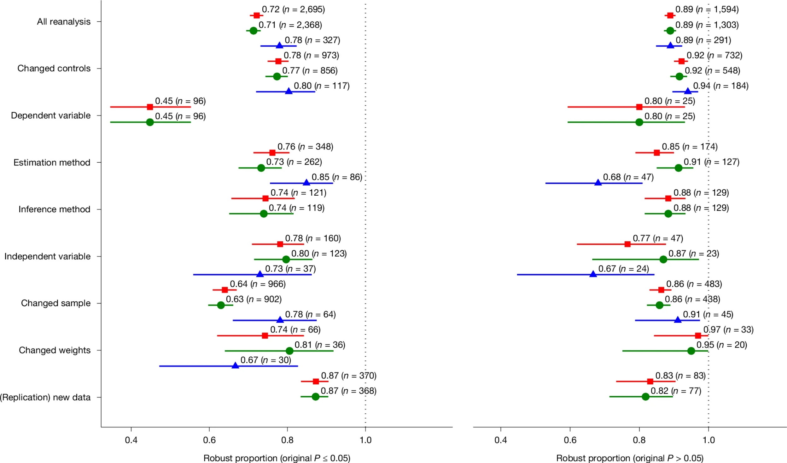
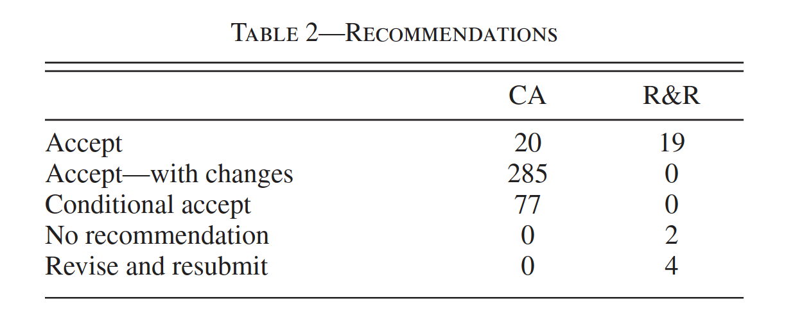
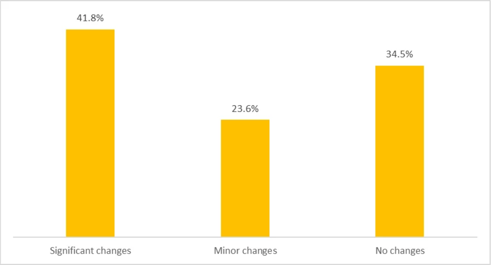

# Pillar C: Challenges for Code

## Computational reproducibility (conditional on data)

::::{.columns}

:::{.column width="50%"}

:::

:::{.column width="50%"}

> ... **computational reproducibility rate of 85%**... 15% ... only partial availability of code or data ... code did not run...

:::

::::

## Robustness of results

::::{.columns}

:::{.column width="50%"}

:::

:::{.column width="50%"}

> ... **a robustness rate of 72%... when alternative analytical decisions were made**

:::

::::

## Reproducibility: our own statistics

::::{.columns}

:::{.column width="50%"}

- Number of reports with:
  - Bugs in code
  - Code not functional
  - Code missing
  - Discrepancies

:::

:::{.column width="50%"}

:::

::::

## Brodeur et al (2026): Coding errors

::::{.columns}

:::{.column width="50%"}

:::

:::{.column width="50%"}

> coding errors in approximately **25%** (economics *26%*, political science *16%*).

:::

::::

## World Bank

::::{.columns}

:::{.column width="50%"}

> **Only 1 in every 3** of the reproducibility packages we’ve reviewed were **fully reproducible** on first submission. [^jones]

[^jones]: Jones, Maria, Luiza Andrade, Luiz Eduardo San Martin, and Avnish Dayal Singh. 2022. “How to Make Sure Your Research Paper Is Reproducible? Evidence from 55 Papers.” September 26. https://blogs.worldbank.org/impactevaluations/how-make-sure-your-research-paper-reproducible-evidence-55-papers-guest-blog-post.

:::

:::{.column width="50%"}

:::

::::

