# Replication and Research Quality {background-color="#4d4d4d"}

::: {.smaller}
Matthew Backus, Edward Miguel, Carolyn Stein (UC Berkeley), Lars Vilhuber (Cornell University)
:::

## Replication and research quality: Ideal experiment {background-color="#4d4d4d"}

**Ideal experiment:**

- Randomly vary researchers' *perceptions* of the probability of replication
- Perfectly measure research quality on various dimensions (data integrity, methods, code quality, sample sizes)
- Estimate the causal effect of replication probability on research quality

## Replication and research quality: Empirical implementation {background-color="#4d4d4d"}

**Key idea 1:** If data is *hard to access*, the probability of replication falls

- Authors who believe replicators cannot run their code will expect a lower level of post-publication scrutiny

**Key idea 2:** However, code is typically available even if the data is not published

- The code can be *inspected* even if it cannot be run
- That can tell us something about the *quality of the code*

## An example {background-color="#4d4d4d"}

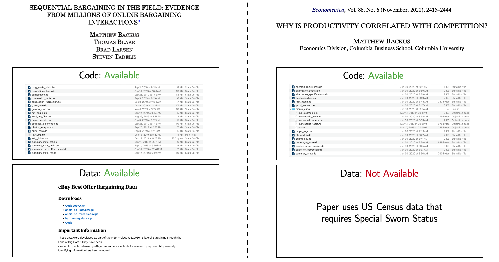

## Quality in our context {background-color="#4d4d4d"}

:::: {.columns}
::: {.column width="48%"}
**What kind of research quality are we measuring?**

- Elements of **code** quality that can be assessed via inspection (commenting, repetition, structure, etc.)
:::

::: {.column width="48%"}
**What kind of research quality are we *not* measuring?**

- Elements of code quality that can only be assessed by *running the code* (e.g., whether the code runs, runtime, whether it produces the correct results)
- Data manipulation or fraud
- Other elements of research quality (e.g., sample size, methods, etc.)
:::
::::

## Summary of results {background-color="#4d4d4d"}

- **Publicly available data** is associated with **higher quality code** on average
- The results are small but precise: We estimate quality increases of *0.05 to 0.1 standard deviations*
- The results appear to be driven by code that is better organized and easier to understand
- Results are from a (largely) pre-AI time.

## Measurement {background-color="#4d4d4d"}

## Sample {background-color="#4d4d4d"}

We download all available replication packages for the following journals:

| Journal | Years | Papers |
|:---------------------|:-----------:|-------:|
| AER                  | 2010--2026  | 1,387 |
| AEJ: Applied         | 2010--2026  |   536 |
| AEJ: Policy          | 2010--2026  |   562 |
| AEJ: Macro           | 2010--2026  |   373 |
| AEJ: Micro           | 2010--2026  |   188 |
| Econometrics Journal | 2021--2024  |    61 |
| JPE                  | 2010--2024  |   467 |
| QJE*                 | 2016--2024  |   260 |
| ReStat*              | 2010--2024  | 1,144 |
| ReStud               | 2013--2024  |   290 |
| **Total**            |             | **5,268** |

## Measuring data availability {background-color="#4d4d4d"}

*UC Berkeley undergraduates* read through the replication packages and followed a detailed flow chart to answer two key questions:

1. Is the raw data posted in the replication package?
2. If not, is the data easy or hard to obtain?
   - Easy to obtain: publicly available but requires a simple registration
   - Hard to obtain: requires a data use agreement, fee, special access, etc.

## Coding data availability: Binary {background-color="#4d4d4d"}

We classify papers into two categories:

- **Data available = 1:** All of the raw data is posted in the replication package
- **Data available = 0:** All of the raw data is *not* posted in the replication package

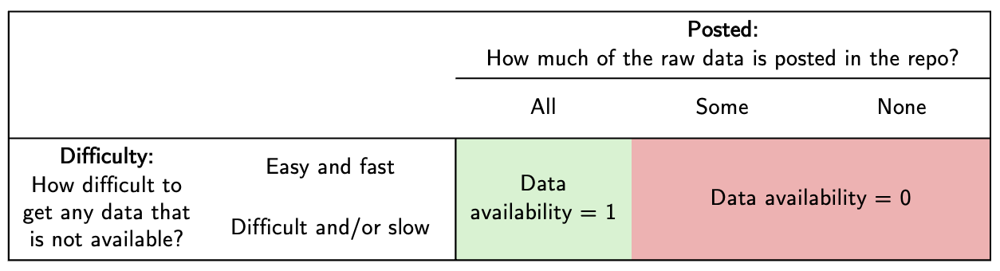

## Coding data availability: Levels {background-color="#4d4d4d"}

We classify papers into three categories:

- **Data available = 2:** All of the raw data is posted in the replication package
- **Data available = 1:** Not all of the raw data is posted in the replication package, but any missing data is easy to obtain
- **Data available = 0:** Not all of the raw data is posted in the replication package, and some missing data is hard to obtain

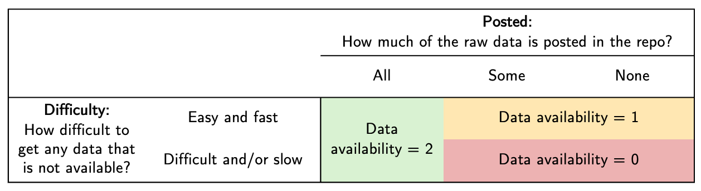

## Measuring code quality {background-color="#4d4d4d"}

We focus on dimensions of code quality that can be assessed without running the code and are more objective:

1. Comments
2. Repetition
3. Variable naming
4. Formatting
5. Structure and organization
6. Ease of understanding

We provide ChatGPT with a detailed rubric and ask it to score each paper's code on these dimensions.

## Empirical strategy and results {background-color="#4d4d4d"}

## Empirical strategy {background-color="#4d4d4d"}

We estimate the following regression at the paper-level:

$$Q_i = \alpha + \beta\cdot\textrm{Data}_i + \tau_{t(i)} + \gamma\cdot X_i + \varepsilon_i$$

where:

- $Q_i$ is our measure of the paper's code quality
- $\textrm{Data}_i$ is our measure of the paper's data availability
- $\tau_{t(i)}$ is a year fixed effect
- $X_i$ is a vector of paper-level controls (e.g., lines of code, number of authors, etc.)

## Results (Binary) {background-color="#4d4d4d"}

Using the binary measure, data being available is associated with a 0.05 standard deviation increase in code quality (average across all measures)

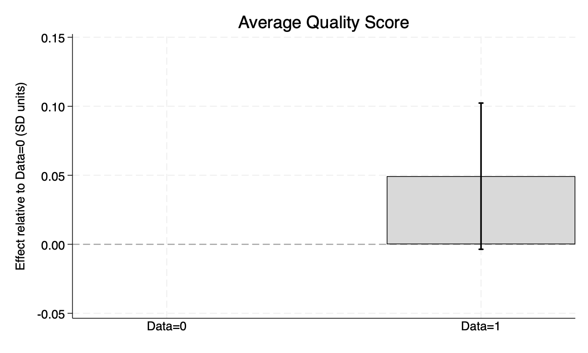

## Results (Levels) {#results-levels background-color="#4d4d4d"}

Using the levels measure, data being available is associated with a 0.1 standard deviation increase in code quality (average across all measures)

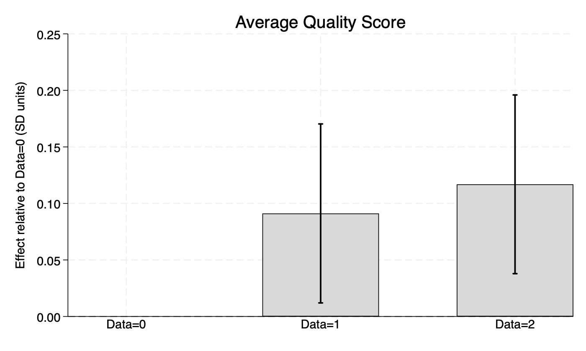

[Results by dimension](#dim-comments)

## Concern: Omitted variables bias {background-color="#4d4d4d"}

A paper's data availability may be correlated with other factors that also affect code quality. We address this concern in two ways:

1. We include a rich set of **paper-level controls** in our regression
   - We focus on variables most likely to be correlated with code complexity: number of lines of code, number of coding languages
2. We use a **within-author design** to compare papers by the same author that differ in data availability
   - Key idea: many of the covariates that could confound the relationship between data availability and code quality are likely to be constant for a given author
   - For paper $i$ by author $j$, we estimate $Q_{ij} = \alpha_j + \beta\cdot\textrm{Data}_{ij} + \gamma\cdot X_{i} + \varepsilon_{ij}$, with standard errors clustered at the paper level

## Robustness {background-color="#4d4d4d"}

Results are very similar when adding controls and author fixed effects:

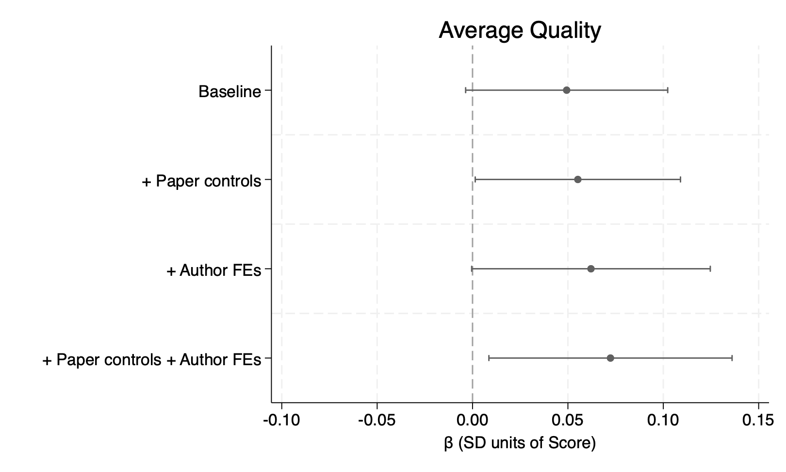

## Conclusion {background-color="#4d4d4d"}

- Using proprietary or restricted-access data allows researchers to write papers that would not otherwise be possible
- However, our work shows that there is a **tradeoff:** this does appear to come at a cost in terms of the quality, likely due to diminished scrutiny
- The effects we measure are **small**, suggesting that benefits may outweigh the costs most of time
  - However, we caution that we only measure one narrow dimension of code quality. Other important dimensions may be more sensitive (fraud, data manipulation, etc.)

## Appendix: Results by dimension {background-color="#4d4d4d"}

## Results by dimension: Comments {#dim-comments background-color="#4d4d4d"}

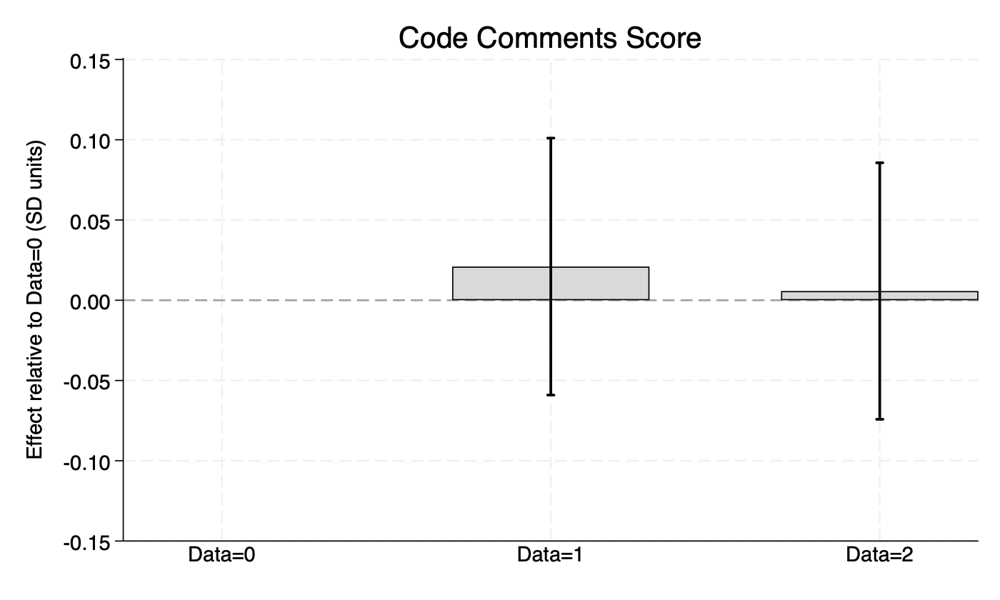

[Back](#results-levels)

## Results by dimension: Repetition {#dim-repetition background-color="#4d4d4d"}

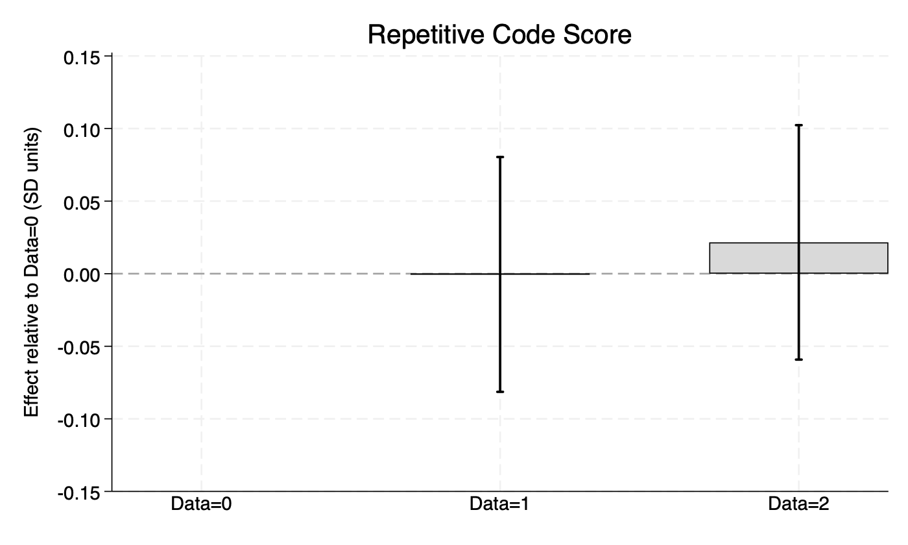

[Back](#results-levels)

## Results by dimension: Variable naming {#dim-varnames background-color="#4d4d4d"}

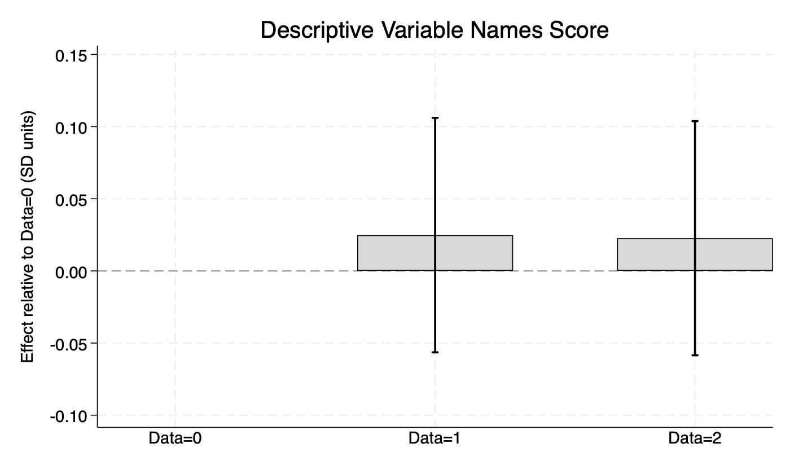

[Back](#results-levels)

## Results by dimension: Formatting {#dim-format background-color="#4d4d4d"}

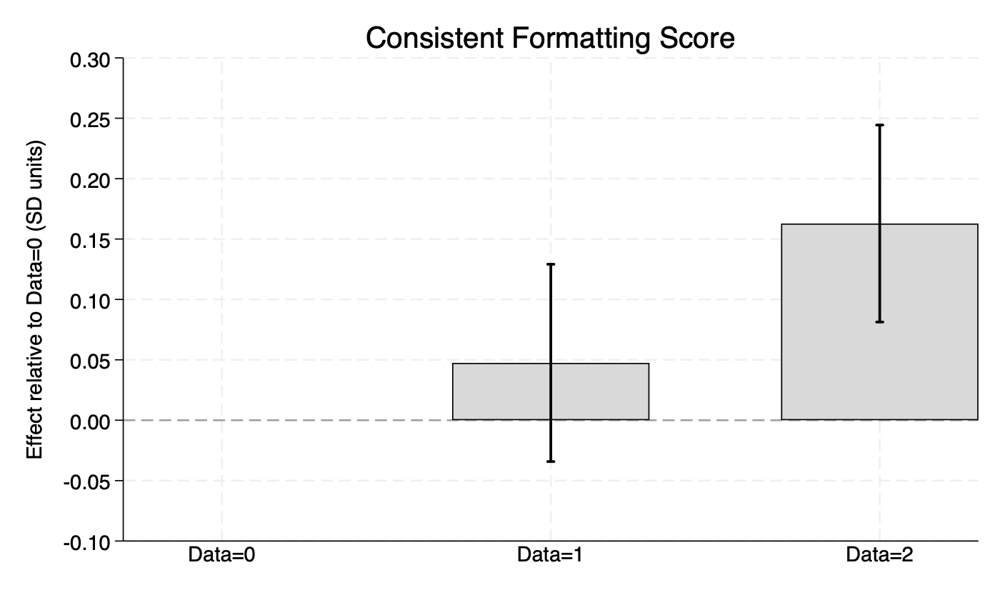

[Back](#results-levels)

## Results by dimension: Structure and organization {#dim-structure background-color="#4d4d4d"}

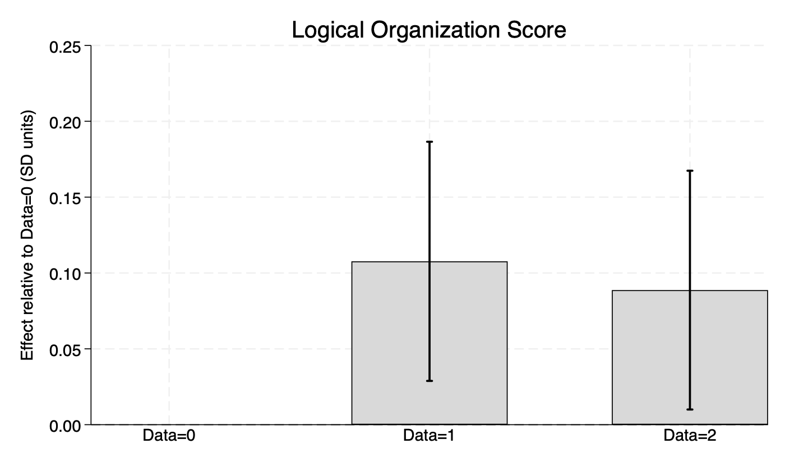

[Back](#results-levels)

## Results by dimension: Ease of understanding {#dim-understand background-color="#4d4d4d"}

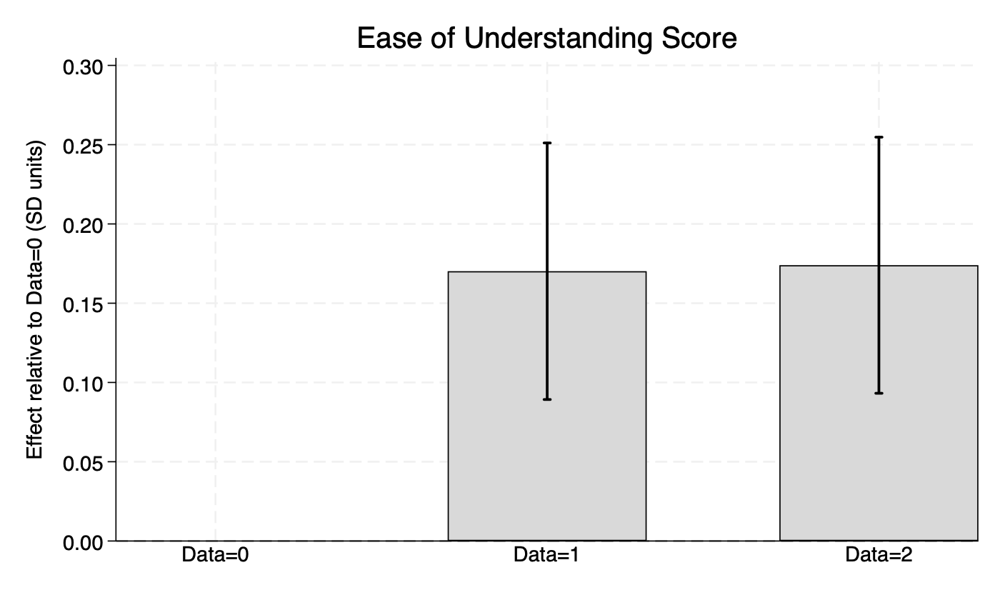

[Back](#results-levels)
