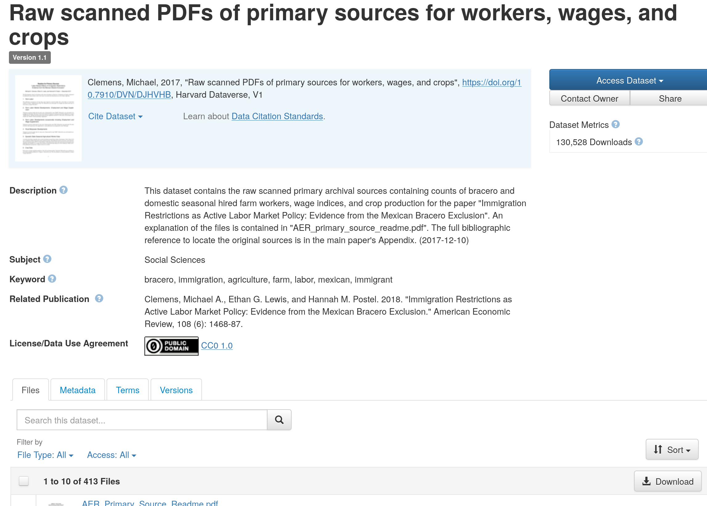
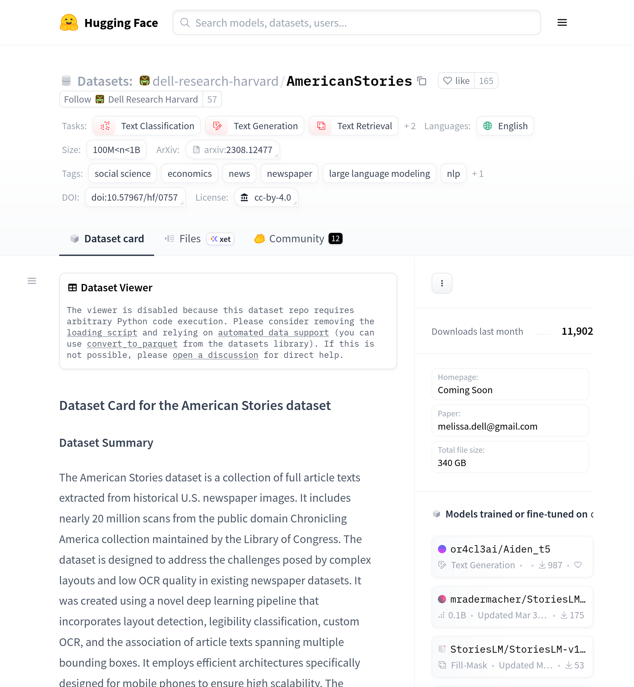
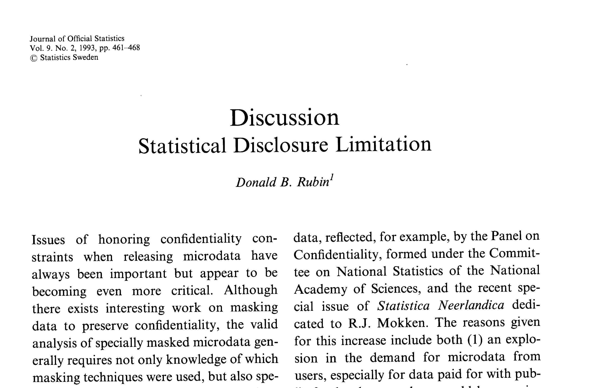

# Thoughts about solutions

# A - Data quality

::::{.columns}
:::{.column width="50%"}

:::

:::{.column width="50%"}

- LLM-generated data is popular
- Draw from an inference distribution
  - Important: Variability matters (Coqueret et al, 2026)
  - Correct way of handling variability: equivalent to multiple imputation

:::
::::

## Coqueret et al (2026): what to report {.smaller}

- Be precise about all parameters of the generation process
- Store raw model inputs and outputs of every run (with possible recognition for privacy concerns)
- Document the observed variability

## Existing examples

::::{.columns}
:::{.column width="50%"}
> Clemens, Michael, 2017, "**Raw scanned PDFs of primary sources for workers, wages, and crops**", <https://doi.org/10.7910/DVN/DJHVHB>, Harvard Dataverse, V1

:::
:::{.column width="50%"}
> Clemens, Michael, 2018, "**Replication Data for:** Immigration Restrictions as Active Labor Market Policy: Evidence from the Mexican Bracero Exclusion", <https://doi.org/10.7910/DVN/17M4ZP>, Harvard Dataverse, V1

:::
::::

## Existing examples {.smaller}

::::{.columns}
:::{.column width="50%"}

`analysis data` $\widetilde{D}$:

- could be preserved separately, if multi-purpose
  - example: Dell's "[**American Stories**](https://doi.org/10.57967/hf/0757)" LLM [@dell_research_harvard_2023]

:::
:::{.column width="50%"}

:::
::::

## LLM output as a Multiple Imputation problem {background-color="#4d4d4d" .smaller}

:::: {.columns}

::: {.column width="50%"}
- Rubin (1993, *J. Official Statistics*) is credited with one of the first formalizations of multiple imputation
- Often used for privacy protection, but also missing data
- See Reiter (2004, *Survey Methodology*; 2005, *J. Stat. Plan. Inference*) for inference rules
:::
::: {.column width="50%"}

:::
::::

## LLM output as a Multiple Imputation problem {auto-animate=true transition=fade .smaller}

**Recommendation**

:::: {.columns}
::: {.column width="50%"}
- Run the LLM (query) multiple times (e.g., 10 times) -> $D^*_m, m=1,...,10$
:::
::: {.column width="50%"}

:::
::::

## LLM output as a Multiple Imputation problem {auto-animate=true transition=fade .smaller}

**Recommendation**

:::: {.columns}
::: {.column width="50%"}
- Run the downstream analysis for each $D^*_m$ -> ${q}_m, v_m, m=1,...,10$
:::
::: {.column width="50%"}

:::
::::

## LLM output as a Multiple Imputation problem {auto-animate=true transition=fade .smaller}

**Recommendation**

:::: {.columns}
::: {.column width="50%"}
- Use multiple imputation rules (Rubin, Reiter, etc.) to report
  - sampling variability inherent in the underlying data $D^*$: $\bar{v}$
  - variability due to the variability in the LLM output $b$
:::
::: {.column width="50%"}

:::
::::

## Variance decomposition  {.smaller}

$$\bar{q}_m = \sum_{i=1}^{m} q_i / m, \qquad b_m = \sum_{i=1}^{m} (q_i - \bar{q}_m)^2 / (m-1), \qquad \bar{v}_m = \sum_{i=1}^{m} v_i / m$$

Report $\bar{q}_m$ with variance $T_p = b_m/m + \bar{v}_m$

- $\bar{v}_m$:  sampling variability you would face even with a perfectly deterministic instrument
- $b_m$:  variability **added by imputation process**

# B - Data provenance

::::{.columns}
:::{.column width="50%"}

:::

:::{.column width="50%"}

:::
::::

## 

- Evidence: DOI &rarr; checksum &rarr; verifiable
- Testimony: Data Editor serving as verifier
  - e.g. an image of the title-page footnote
  - also has limits [e.g. Chinese mobile network case — reference TBD]
- Transparency!

# C - Code

::::{.columns}
:::{.column width="50%"}

:::

:::{.column width="50%"}

- Verified reproducibility - addresses completeness, credibility, to some extent trust
  - Mention reproducibility services
  - Mention SIVACOR/TRACE

:::
::::

# D - Documentation

::::{.columns}
:::{.column width="50%"}

:::
:::{.column width="50%"}

- Potential for LLM assistance
  - Preparing documentation
  - Ensuring consistency between documentation (article) and code (Miklos' harness)

:::
::::

