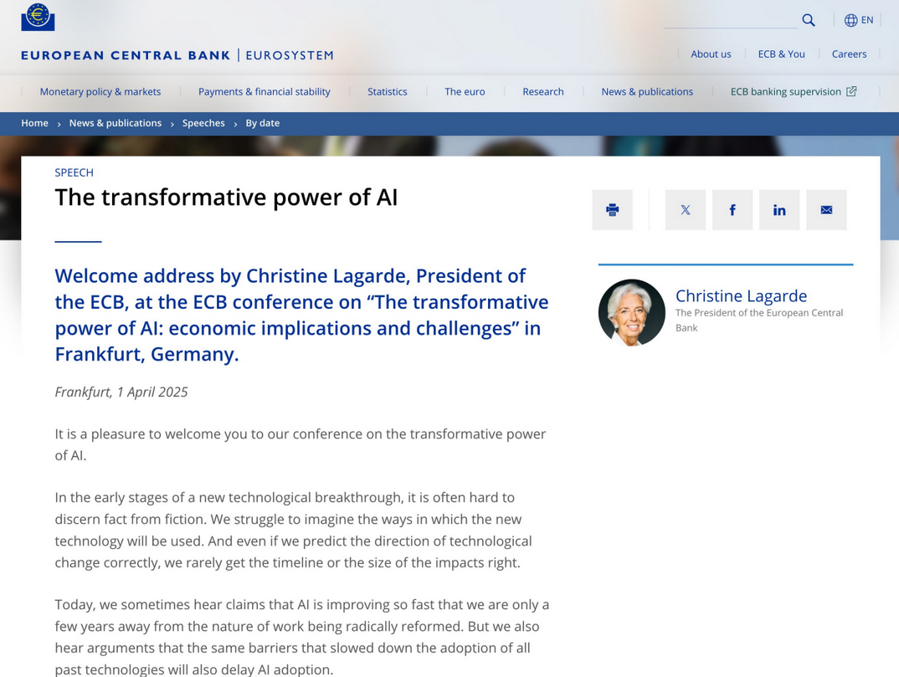

## B - Data provenance

::::{.columns}
:::{.column width="50%"}

:::

:::{.column width="50%"}

- What if an LLM invents data? Data existence?
- Robots entering data
- Modern methods of provenance assurance, and their limits

:::
::::

## Who is this person? (2)

## Aidan Toner-Rodgers

## Maybe you've heard about him

::::{.columns}  

::: {.column width="50%"}

::: 
::: {.column width="50%"}

["AI-assisted researchers discover 44% more materials, resulting in a 39% increase in patent filings."](https://www.economist.com/finance-and-economics/2025/05/22/what-the-failure-of-a-superstar-student-reveals-about-economics)

:::
::::

## Now {.smaller}

::::{.columns}  

::: {.column width="10%"}
::: 
::: {.column width="80%"}
"MIT now declares “**no confidence in the provenance**, reliability or validity of the data and...in the veracity of the research”. Mr Toner-Rodgers’s paper has been *withdrawn* from the pre-print repository on which it first appeared [arXiv]; ... The lab at the heart of his findings remains **unknown**." 

:::
::: {.column width="10%"}
:::
::::

# How can we know that a data source is reliably obtained?
