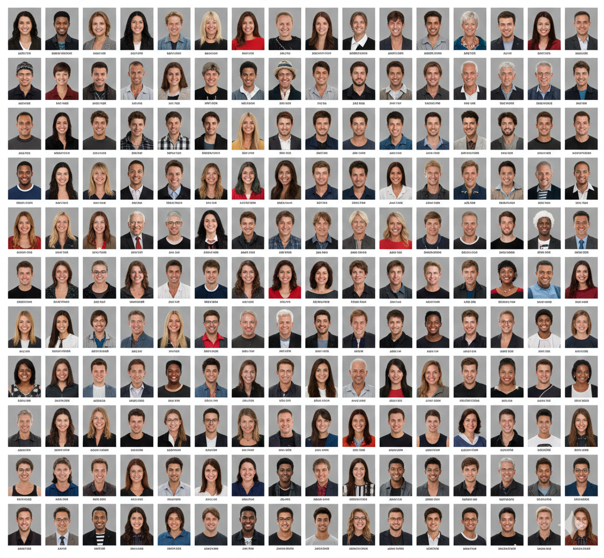

# Thoughts on Future Paths

## What can researchers do?

## Data quality

- As (co-)data producers:
  - Write quality reports
  - Aim for "fit for purpose"
    - Same tool as for literature: **data citation** allows for tooling and assessment

## Data provenance

- Evidence: DOI &rarr; checksum &rarr; verifiable
- Testimony: Data Editor serving as verifier
  - e.g. an image of the title-page footnote
  - also has limits [e.g. Chinese mobile network case — reference TBD]
- Transparency!

## Side note: LLMs and provenance

- Evidence of data quality &rarr; variability
- LLM training materials: example of historical records
  - [Clemens — reference TBD]
  - [Dell — reference TBD]

## Code quality: the impact of AI

- Should improve
- But: complexity
  - increased presence of scaffolding (Makefile, Python, Linux)
- AI in secure environments?

## Documentation: AI can help

- Consistency between article and code
- A README template can help &rarr; feed it to AI

::: {.img-placeholder}
IMAGE PLACEHOLDER: [Koren GUI — reference TBD]
:::

## But...

- Please tell it to be brief
- No [CoR — expand TBD]
- Re-read: you are still responsible

## Transparency is the norm

::::{.columns}

::: {.column width="50%"}

:::
::: {.column width="50%"}

[nearly 5,000 authors](https://aeadataeditor.github.io/aea-cumulative-summary/impacts_of_aea_data_editing.html#authors-reached) who have had [their work](https://doi.org/10.3886/E159301V1) verified by the AEA Data Editor and team.

:::
::::

## You can do it, too!

::::{.columns}
::: {.column width="20%"}
:::
::: {.column width="60%"}

:::
::: {.column width="20%"}
:::
::::

## Bonus: You can help, too!

::::{.columns}
::: {.column width="10%"}
:::
::: {.column width="80%"}

- Apply the reproducible tools *not just for research*: policy analysis, program evaluation, business analytics, etc.
- Push data providers to provide better access tools (**API access**, checksums, **DOI**)
- Be able to explain why this *benefits* them!

:::
::: {.column width="10%"}
:::
::::
