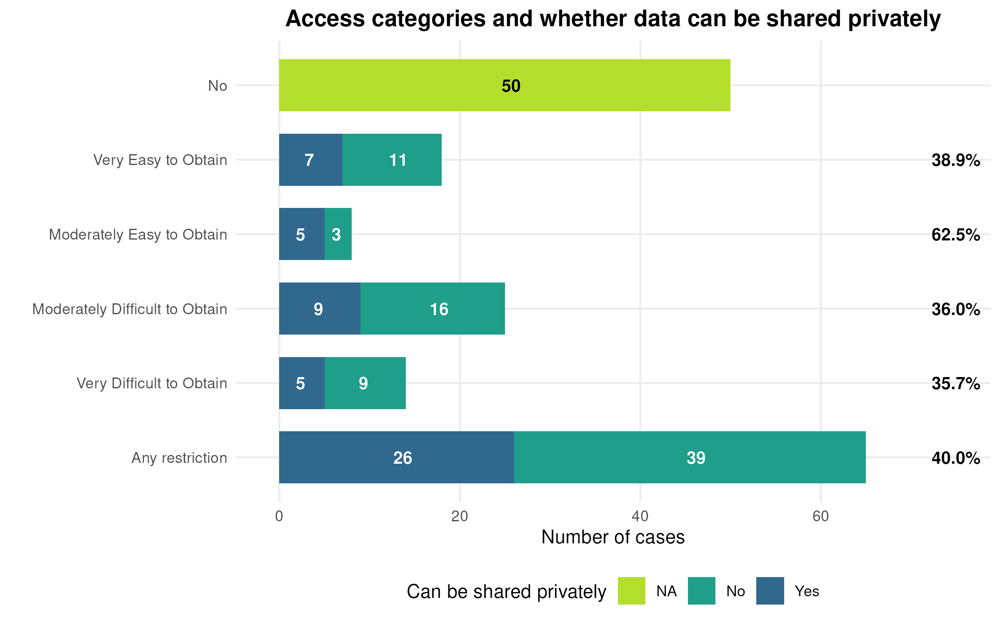
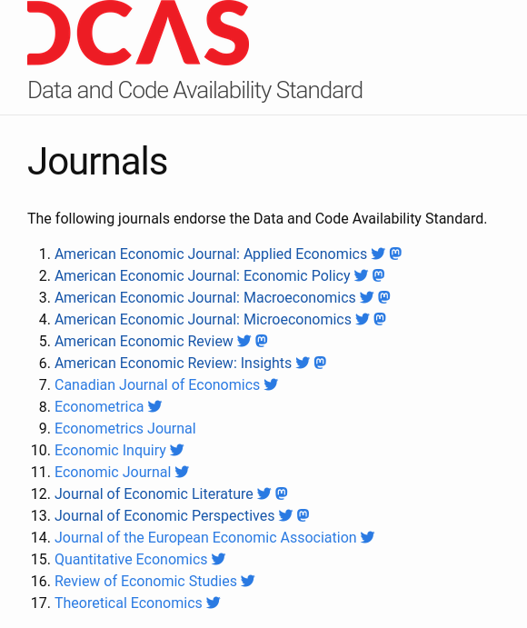

# Reproducibility in Economics

## AEA Journals

## What is a replication package?

- [AEA Data and Code Availability policy](https://www.aeaweb.org/journals/data/data-code-policy)
- [Data and Code Availability Standard](https://datacodestandard.org/)  
- [AEA Data and Code Repository](https://www.openicpsr.org/openicpsr/search/aea/studies)

## AEA policy

## Tenets of the Policy

- **Transparency** 
- **Completeness** 
- **Preservation**

## Transparency

- Provenance of the *data*
- Processing of the data, from raw data to results (code)

> Prior to acceptance, authors of papers that contain empirical work, simulations, or experimental work **must provide the data, code, and other details of the computations sufficient to permit replication**. These materials must be made available and retained in an openly accessible trusted data repository, such as the AEA Data and Code Repository.

## Completeness

- All data needs to be identified and and access described
- All code needs to be described and provided 

> **Raw data** used in the research (primary data collected by the author and secondary data not otherwise available) must be included in the replication package unless the exceptions for non-public data apply. 
 
## Completeness

- All data needs to be identified and and access described
- All code needs to be described and provided 

>  (i) commit to **preserving data** and code for a period of no less than five years following publication of the manuscript, ... (iv) **publicly document the source of the data**, including appropriate contact information. 

## Preservation

- All data needs to be preserved for future replicators
  - Ideally, within the replication package, subject to ToU, for convenience
  - Otherwise, in a **trusted repository**

## Preservation

- Code must be in a trusted repository
  - Usually, within the replication package
  - Websites, Github, are *not acceptable*

## Historically

## Modern preservation

## Side note: Government

- Data are often confidential
  - Are they preserved? (**NARA**, *Archives de France* otherwise)
  - Are they accessible to others? (**FSRDC**, NORC, *CASD*, etc.)
- Code is sometimes deemed "confidential"
  - We will return to this topic!

## How confidential/restricted? {.smaller}

| Category | Explanation |
|----------|-------------|
| Very Easy to Obtain | Request takes a **few minutes**, no associated costs,  expected response time: a *few days* |
| Moderately Easy to Obtain | Request takes **less than an hour** with minimal cost |
| Moderately Difficult to Obtain | *Multipage application*; request **needs university approvals**; request involves *significant cost*;  uncertain approval |
| Very Difficult to Obtain | Request  and/or **access** **in person**;  requires *substantial funding*; data and/or **access mechanism may no longer exist** |

## How often confidential? {.smaller}

AER articles in 2024 ([Vilhuber, 2025, Revue Economique](https://shs.cairn.info/journal-revue-economique-2025-5-page-697?lang=en))

::::: {.columns}
::::{.column width="10%"}
::::
::::{.column width="80%" .white-col}

::::
::::{.column width="10%"}
::::
:::::

## Exceptions to the Policy

None

## ...

... there is a grey zone:

- When data do not belong to researcher, *no control over preservation, access*!
- Sometimes, **ToU prevent researcher from revealing metadata** (name of company, location)

## Transparency again

- However: 
  - No exception for need to **describe** access (own and other)
  - No exception for need to fully **describe** processing (possibly with redacted code)

# Enforcement of the AEA Policy

## Reproducibility?

## Reproducibility 

> "Reproducibility" refers to the ability of a
researcher to duplicate the results of a prior
study using the same materials and
procedures as were used by the original
investigator." [^Bollen]

[^Bollen]: Bollen et al. 2015. "Social, Behavioral, and Economic Sciences Perspectives on Robust and Reliable Science."
National Science Foundation. https://www.nsf.gov/sbe/AC_Materials/SBE_Robust_and_Reliable_Research_Report.pdf.

## Testing for ...

- **Transparency** 
- **Completeness** 

through **reproducibility**

## Criteria: Transparency?

- Can a reasonable person understand the description of **acquisition of data** and **processing** via code?

## Criteria: Completeness?

- Do the provided materials allow to reproduce all the **tables** and **figures** in the paper?

## Who is the target person?

## Who is the target person? {.smaller}

::::{.columns}

:::{.column width="50%"}

Over the past 6 years, over **170** *undergraduate* students have been involved in verifying these articles.

- Economics, biostatistics, sociology
- Typically recruited in sophomore or junior year, but will consider freshmen through master's students

:::

:::{.column width="50%"}

:::

::::

## Who is the target person?

- **You** (in 4 years, between prepping 2 new courses,
an R&R, a new child, and tenure coming up in 2
years)
- **Your RA** (in 4 years, because you are… see above)
- Your **future readers** who will cite you (in 4-10 years, who may want to extend or replicate
your study, but won’t if it is too complex)

## Who is the target person?

- **Your successor** (in 5 years, when you have won the lotto and are in Tahiti)
- **Partner agencies** (who are interested in implementing this)
- **Support staff** who will take this and run it for you, without bugging you

# Tracing inputs from outputs

## {background-image="images/Vilhuber-Presentation2020-2020-03-20-52.png" background-size="contain" transition="fade" transition-speed="fast"}

[^cholera1]

[^cholera1]: Ambrus, Attila, Erica Field, and Robert Gonzalez. 2020. "Loss in the Time of Cholera: Long-Run Impact of a Disease Epidemic on the Urban Landscape." American Economic Review, 110 (2): 475–525. <https://doi.org/10.1257/aer.20190759>

## {background-image="images/Vilhuber-Presentation2020-2020-03-20-53.png" background-size="contain" transition="fade" transition-speed="fast"}

## {background-image="images/Vilhuber-Presentation2020-2020-03-20-54.png" background-size="contain" transition="fade" transition-speed="fast"}

## {background-image="images/Vilhuber-Presentation2020-2020-03-20-55.png" background-size="contain" transition="fade" transition-speed="fast"}

## {background-image="images/Vilhuber-Presentation2020-2020-03-20-56.png" background-size="contain" transition="fade" transition-speed="fast"}

## {background-image="images/Vilhuber-Presentation2020-2020-03-20-57.png" background-size="contain" transition="fade" transition-speed="fast"}

[^cholera2]

[^cholera2]: Ambrus, Attila, Field, Erica, and Gonzalez, Robert. Data and Code for: Loss in the Time of Cholera: Long-run Impact of a Disease Epidemic on the Urban Landscape. Nashville, TN: American Economic Association [publisher], 2020. Ann Arbor, MI: Inter-university Consortium for Political and Social Research [distributor], 2020-01-31. <https://doi.org/10.3886/E111523V2>

## {background-image="images/Vilhuber-Presentation2020-2020-03-20-58.png" background-size="contain"  transition="fade" transition-speed="fast"}

# Reproducibility in Economics and beyond

## {background-image="images/socsci-webpage.png" background-size="contain"}

## Data Editors {.smaller}

::::{.columns}

:::{.column width="50%"}

- [American Economic Association](https://www.aeaweb.org/journals/) (8)
- [Econometric Society](https://www.econometricsociety.org/) (3)
- [Canadian Journal of Economics](https://www.economics.ca/cje-home) (1)
- [Royal Economic Society](https://res.org.uk/journals/) (2)
- [Western Economic Association International](https://weai.org/view/EI-Journal-Policies) (1)
- [European Economic Association](http://www.eeassoc.org/journal) (1)
- [Review of Economic Studies](https://www.restud.com/) (1)
- [**Journal of the European Economic Association**](https://academic.oup.com/jeea) (1)
- [**Journal of Political Economy**](https://www.journals.uchicago.edu/journals/jpe/about) (3)

:::

:::{.column width="50%"}

:::

::::

## Common policies {.smaller}

<https://social-science-data-editors.github.io/>

::::{.columns}

:::{.column width="50%"}

:::

:::{.column width="50%"}

:::

::::

## Elsewhere: Political Science {.smaller}

::::{.columns}

:::{.column width="50%"}

:::

:::{.column width="50%"}

:::

::::

## Elsewhere: Sociology {.smaller}

::::{.columns}

:::{.column width="50%"}

[^hdsr1]

:::

::::

[^hdsr1]:  Weeden, K. A. (2023). Crisis? What Crisis? Sociology’s Slow Progress Toward Scientific Transparency  . Harvard Data Science Review, 5(4). <https://doi.org/10.1162/99608f92.151c41e3>
